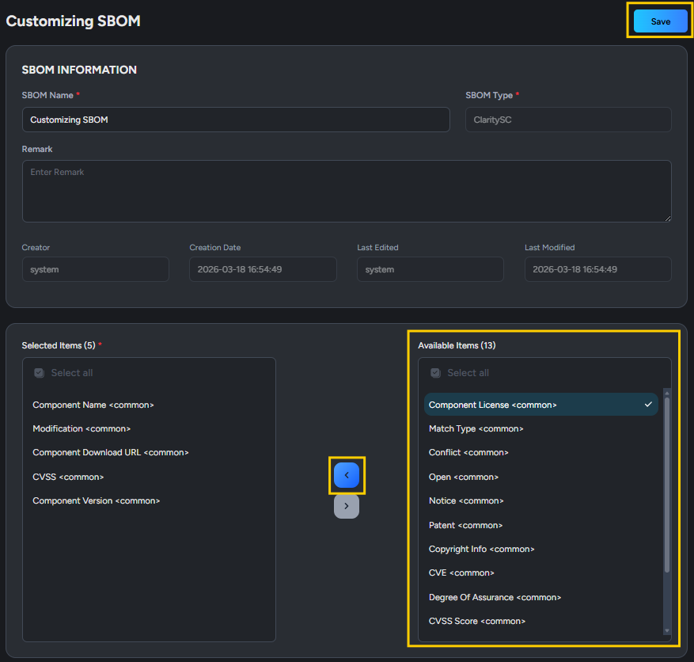

# SBOM format management

#### SBOM Management

* In the System > SBOM menu, you can view the list of default SBOM formats and add or edit new formats.

<figure><figcaption></figcaption></figure>

#### 1. Adding a New SBOM Format

Click the \[Add New SBOM] button to create a new SBOM format. Enter the mandatory SBOM Name, select the items to be included, and save.

<figure><figcaption></figcaption></figure>

#### 2. Editing an SBOM Format

* Editing is possible if the logged-in account has SBOM Edit permissions in its Role. ([Refer to Role Configuration](user-role-management.md))
* If the account lacks this permission, it will be restricted to View-only access.
* Fixed formats, such as SPDX 3.0 and CycloneDX 1.6, cannot be modified.

<figure><figcaption></figcaption></figure>

***
