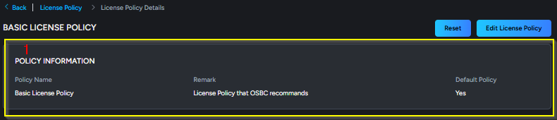
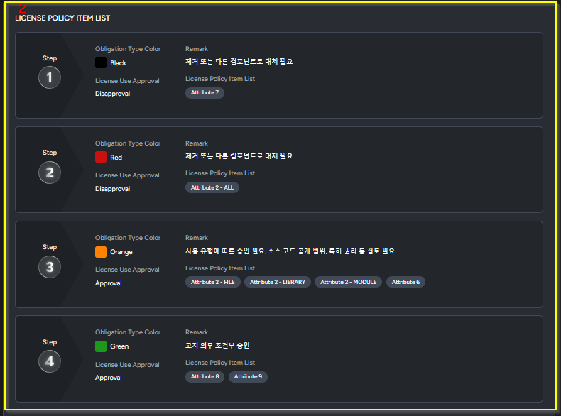

# 정책 관리

#### 1. 정책 기능 개요

Policy 메뉴에는

* [**License Policy - 라이선스 정책**](undefined-1.md#id-2.-license-policy)
* [**Vulnerability Policy - 취약점 정책**](undefined-1.md#id-5.-vulnerability-policy)
* [**Asset Classification - 자산분류**](undefined-1.md#id-7.-asset-classification)

3가지 하단 메뉴가 있으며&#x20;

기업의 _**정책**_ 따른 _**라이선스 정책**_ 설정 및&#x20;

기업에 _**자산중요도**_&#xC5D0; 따른 _**보안취약점**_&#xC744; 설정할 수 있습니다.

#### 2. License Policy - 라이선스 정책 기능

**Policy > License Policy** 메뉴로 이동하면 라이선스 정책 목록을 보여줍니다.

* 시스템에서 제공하는 기본 라이선스 정책 3가지입니다.

<figure><figcaption></figcaption></figure>

#### 2. 라이선스  정책 상세 화면

* 라이선스 정책  상세  화면은 크게 다음 3개의 영역으로 구성됩니다.

**(1).  라이선스 정책 메타정보**

해당 라이선스 정책의 정책 정보를 표시합니다. 정책 이름과 정책 이행사 및 시스템의 기본 정책 여부를 표시합니다.

<figure><figcaption></figcaption></figure>

**(2). 라이선스 정책 아이템 목록**

&#x20;라이선스 정책 아이템 목록에서는 단계 별로 설정된 정책 세부 항목을 볼 수 있습니다.

1. Obligation Type Color - 의무 유형 색상
   1. 해당하는 _**라이선스 정책 단계**_&#xC5D0; 해당하면 표시할 색상을 정할 수 있습니다.
   2. 프로젝트에서 검증 했을 때, 프로젝트 상세 화면에서 설정한 _**의무 유형(Obligation Type)**_&#xC5D0; 대해 확인할 수 있습니다.
2. License Use Approval - 라이선스 사용승인
   1. 이 단계의 _**라이선스 정책에**_ 에 해당 했을 때, 승인, 불승인, 조건부승인 여부를 설정합니다.
3. Remark - 비고
   1. 해당하는 _**라이선스 정책 단계**_&#xC5D0; 대한 이행사항을 작성합니다.
4. 순서대로 1 단계부터 우선순위가 높습니다.

<figure><figcaption></figcaption></figure>

**(2-1). 라이선스 정책 단계에&#x20;**_**속성(**_**Attribute**_**)**_**&#x20;설정**

1. 해당 라이선스 정책 단계에 속성을 _**드래그 앤 드롭**_&#xC73C;로 추가할 수 있습니다.
2. 속성에 해당하면 해당 라이선스 정책 단계가 됩니다.

<figure><figcaption></figcaption></figure>

**(3). 라이선스 정책 규칙 예외 목록**

앞선(2)에서 설정한 라이선스 정책을 무시하는 _**예외 라이선스 정책**_&#xC744; 설정할 수 있습니다.

<figure><figcaption></figcaption></figure>

#### 3. 기본 라이선스  정책 (Basic License Policy) 설명

이 정책의 시스템에서 제공하는 기본 정책으로 유일하게 정책을 수정 했을 때 _**\[Reset]**_ 버튼을 통해서 기본 값으로 초기화할 수 있습니다.

<figure><figcaption></figcaption></figure>

#### 4. 라이선스 정책 수정/삭제

수정이 필요한 라이선스 정책 상세 화면에서 \[Edit License Policy] 버튼 클릭해서 정책을 수정할 수 있습니다.

* Role에서 _**License Policy Edit**_ 권한이 있는 계정의 사용자만이 라이선스 정책 수정할 수 있습니다.([권한 설정 방법](1q-role.md))
* 사용 중인 라이선스 정책이라면 삭제 불가능 합니다.

<figure><figcaption></figcaption></figure>

#### 5. Vulnerability Policy - 보안취약점 정책 기능

**Policy > Vulnerbility Policy** 메뉴로 이동하면 취약점 정책을 보여줍니다.

* 시스템에서 제공하는 기본 취약점 정책 정보입니다.
* **\[Import, Export]**&#xC73C;로 취약점 정책 가져오고, 내보내기 할 수 있습니다.
* **Importance Level**와  **Severity** 항목과 결합해서 내부 코드 _**Vulnerability Grade**_&#xB97C; 생성합니다.

<figure><figcaption></figcaption></figure>

* **Vuln. Level - 보안취약점  단계**
  * 보안취약점  단계 정보 입니다. 1\~4단계까지 있습니다.
*   **Importance Level - 자산중요도**

    * Asset Classification 자산 분류에서 설정한 _**자산중요도**_&#xC785;니다.

* **Severity - 위험도**
  * 취약점(CVE) 위험도를  의미하는 정보입니다.&#x20;
  * Critical, High, Medium, Low 순서대로 높은 위험도를 의미합니다.
  * 프로젝트 검증 시, 검증 결과에 나오는 Severity(위험도)와 동일한 개념입니다.
* **Vulnerability Grade - 보안취약점 등급**
  * Importance Level  항목과  Severity 항목이 결합하여 내부 등급인 _**보안취약점 등급**_&#xC774; 생성됩니다.
* **Whether to Use -  사용여부**
  * 취약점 정책 사용 여부를 설정합니다.
* **Fulfillment Content - 이행 내용**
  * 보안취약점 등급에 해당하면
    &#x20;준수해야 하는 이행 사항을 작성합니다.
*   **Action - 작업**

    * 정책 항목을 수정/삭제할 때 사용됩니다.

#### 6. 취약점 정책 수정/삭제

수정이 필요한 취약점 정책을 아이콘을 클릭해서 수정할 수 있습니다.

* Role에서 _**Vulnerbility Policy Edit**_ 권한이 있는 계정의 사용자만이 취약점 정책 수정할 수 있습니다.([권한 설정 방법](1q-role.md))
* **\[Add Vulnerability Level]** 버튼으로 취약점 정책 추가할 수 있습니다.
* **\[Reset]** 버튼을 클릭 하면 취약점 정책 기본 값으로 초기화 됩니다.
* 사용 중인  취약점 단계라면 삭제 불가능합니다.

#### 7. Asset Classification - 자산분류

**Policy > Asset Classification** 메뉴로 이동하면 자산분류 목록을 보여줍니다.

* 시스템에서 제공하는 기본 분류 정보입니다.
* Vulnerability Policy에서 _**Importance Level**_&#xB85C; 표시되고, _**Severity**_ 항목과 결합해서 내부 코드 _**Vulnerability Grade**_&#xB97C; 생성하는데 사용됩니다.

<figure><figcaption></figcaption></figure>

**\[Add Asset Classification]** 버튼을 클릭해서 아래의 화면에서 자산 분류를 추가합니다. 필수 값인 자산 분류 이름을  작성하고 자산분류 단계를 선택합니다. 자산 분류 레벨은 4가지이며, 선택해서 저장합니다.

<figure><figcaption></figcaption></figure>

