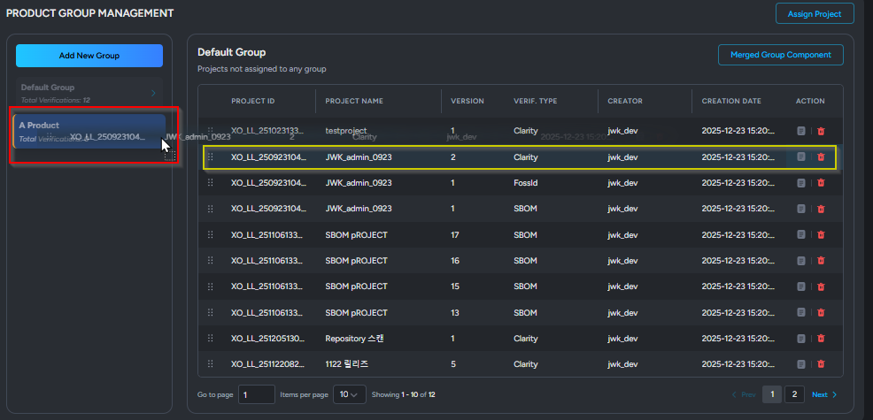

# 프로덕트 관리

#### 1. 프로덕트 기능 개요

* 개별 프로젝트를 프로덕트 단위로 통합 관리하며, 대시보드가 제공하는 프로덕트 별 프로젝트 통계 정보를를 확인 할 수 있습니다.

※ **프로덕트 관리** **메뉴**는 **Role**에서 Manager, Product Creator, Product Manager 해당 권한 없다면 메뉴 비활성화됩니다. 상세한 권한 부여는 [\[프로덕트 Role 설정 방법\]](role.md) 항목을 참고해 주세요.

#### 2. Product Creator 권한

**1.1. 새 프로덕트 생성하기**

1. Product Creator, Manager 권한을 가진 계정으로 로그인 합니다.
2. 좌측 메뉴 Product Management에서 **\[Add New Product]** 버튼 클릭해서 프로덕트 생성합니다.

<figure><figcaption></figcaption></figure>

1. 필수 값인 **프로덕트 이름**과 **프로덕트 매니저**를 선택합니다.
2. 프로덕트 매니저 목록에는 **Product Manager 권한**을 가진 계정만 표시됩니다.

<figure><figcaption></figcaption></figure>

* **Product Name:** 신규로 등록할 프로덕트의 이름을 입력합니다.
* **Product Manager:** 해당 프로덕트를 담당하는 관리자를 선택합니다. 선택된 사용자는 프로덕트 관리 권한을 가집니다.
* **Applied Model:** 프로덕트에 적용되는 모델 또는 제품 유형을 입력합니다.(예: 서비스 모델, 배포 모델 등)
* **Usage Scope:** 프로덕트의 사용 범위 또는 활용 목적을 입력합니다. (예: 내부용, 외부 배포용 등)
* **Inspection Date:** 프로덕트에 대한 점검 예정 날짜를 선택합니다.
* **Release Date:** 프로덕트의 출시 예정 날짜를 선택합니다.
* **Main Contact:** 프로덕트 주요 담당자 연락처 정보를 입력합니다.
* **Default Product:** 기본 프로덕트 여부 설정 (상위 관리자 Superuser, Manager 권한만 지정 가능)

**1.2. 프로덕트 정보 수정**

* **\[Edit Infomation]** 버튼을 클릭해서 **Product Manager**를 변경할 수 있고, 프로덕트를 정보를 수정할 수 있습니다.

**1.3 프로덕트 복제하기**

* **\[Clone Product]** 버튼을 클릭하면 프로덕트를 복제합니다.

<figure><figcaption></figcaption></figure>

<figure><figcaption></figcaption></figure>

* 기존 프로덕트의 그룹과 프로젝트 목록 그대로 복사하여 새로운 프로덕트를 생성합니다.

<figure><figcaption></figcaption></figure>

***

#### 3. Product  Manager 권한

**3.1. 프로덕트에서 새 프로젝트 생성하기**

* 프로덕트 상세 페이지에서 \[Add New Project] 버튼 클릭합니다.

<figure><figcaption></figcaption></figure>

* 빨간색으로 표시된 필수 값을 입력하고, 이 프로젝트의 Project Manager 설정할 수 있습니다. (Project Manager 권한이 있는 계정만 표시)&#x20;
* Product Name은 지금 프로덕트로 고정됩니다.

<figure><figcaption></figcaption></figure>

* 새로운 프로젝트가 추가되고, 클릭 했을때 프로젝트 상세 페이지로 이동합니다.

<figure><figcaption></figcaption></figure>

<figure><figcaption></figcaption></figure>

**3.2. 프로덕트에 프로젝트 할당하기**

* \[Assign Project] 버튼 클릭해서 추가할 프로젝트를 선택합니다.

<figure><figcaption></figcaption></figure>

1. 프로젝트 목록에서 프로젝트를 선택하면, 해당 프로젝트에서 검증이 완료된 모든 버전(차수) 목록이 표시됩니다.
2. 검증이 완료된 Ready 단계의 버전(차수) 목록만 표시됩니다.
3. 선택된 프로젝트는 체크박스로 표시됩니다

<figure><figcaption></figcaption></figure>

* 추가한 프로젝트는 기본 그룹(Default Group)에 자동으로 추가됩니다.

<figure><figcaption></figcaption></figure>

**3.3. 프로덕트 그룹 추가 및 관리**

* \[Add New Group] 클릭해서 새로운 그룹을 추가합니다.

<figure><figcaption></figcaption></figure>

* 그룹 명과 색상을 지정해서 그룹 추가 완료합니다.

<figure><figcaption></figcaption></figure>

* 기본 그룹(Default Group)에 포함된 프로젝트를 드래그 앤 드롭하여 원하는 그룹에 할당할 수 있습니다.

<figure><figcaption></figcaption></figure>

**3.4. 프로덕트 전체 내보내기**

* 상단의 \[Merged Product Components] 버튼을 클릭하면, 해당 프로덕트에 포함된 프로젝트들의 모든 컴포넌트 목록이 표시되고 선택한 SBOM 포맷으로 다운로드할 수 있습니다.

<figure><figcaption></figcaption></figure>

* 해당 프로덕트의 프로젝트에 포함된 컴포넌트를 목록을 확인할 수 있습니다. \[Export] 버튼을 클릭해서SBOM 포맷을 선택해서 다운로드할 수 있습니다.

<figure><figcaption></figcaption></figure>

**3.5. 프로덕트 그룹 별 내보내기**

* \[Merged Group Component] 버튼을 클릭하면, 선택한 그룹에 포함된 프로젝트들의 컴포넌트 목록을 통합해서 표시합니다. \[Export] 버튼을 클릭해서SBOM 포맷을 선택해서 다운로드할 수 있습니다.

<figure><figcaption></figcaption></figure>

