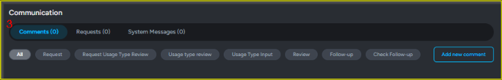

# Clarity 검증하기

#### 1. Clarity 검증 프로세스 개요

* Clarity 검증은 **8단계 워크플로우**로 진행됩니다.
* 개발자는 관리자 함께 진행할 수 있습니다.
* 관리자는 모든 단계를 혼자 진행할 수 있습니다.
* 검증 흐름: _스캔 → Usage Type Input  → Review→ Follow-up → 완료_
* 워크플로우 바에서 현재 단계 확인할 수 있습니다.

<figure><figcaption></figcaption></figure>

#### 2. 검증 요청(스캔) 하기

\[Clarity Verification] 클릭해서 검증할 파일을 선택합니다.

<figure><figcaption></figcaption></figure>

**Clarity Verification Request** 창에서 다음 항목을 설정합니다.

<figure><figcaption></figcaption></figure>

* **Import Method**:
  * Repository: 저장소 주소를 입력하여 검증할 수 있습니다.
  * Upload file: 로컬 파일을 업로드하여 검증을 요청할 수 있습니다.
* **Request Message**: 검증 요청 시, 요청 메시지를 입력할 수 있습니다.

\[Request] 버튼을 클릭하면 Clarity 도구를 통해 파일 분석이 시작되며 분석이 끝나면 검증 프로세스가 진행됩니다.

<figure><figcaption></figcaption></figure>

#### 3. Clarity 검증 상세 화면 설명

* Clarity 검증 화면은 크게 다음 5개의 영역으로 구성됩니다.

<figure><figcaption></figcaption></figure>

<figure><figcaption></figcaption></figure>



#### (1). 프로젝트 메타정보

* 프로젝트 이름, 버전, 검증 도구, 요청자, 요청일, 실제 파일 이름,  스캔 유형, 부서, 수정일, 재 검증 기한 \
  해당 프로젝트의 주요 정보를 확인할 수 있는 영역입니다.

<figure><figcaption></figcaption></figure>




#### (2). Clarity 검증 워크플로우

* Clarity 검증 워크플로우는 총 8단계로 진행되며, 화면에서 현재 진행 상태를 확인할 수 있습니다. 개발자는 관리와 함께 단계를 진행할 수 있으며, 관리자는 모든 단계를 진행할 수 있습니다.

<figure><figcaption></figcaption></figure>




#### (3). 커뮤니케이션 기능(Communication)

* 검증 과정에서 발생하는 다양한 메시지를 모아 관리할 수 있는 공간입니다. 이 영역은 검증 과정 중 개발자와 관리자가 상호 협업하기 위한 핵심 커뮤니케이션 기능을 제공합니다.
  * **Comments**: 검증 단계 별로 개발자 및 관리자가 남긴 코멘트를 확인하고 의견을 교환할 수 있습니다.
    * 관리자는 모든 단계에 코멘트 남길  수 있습니다.
    * 개발자는 요청 단계에서만 코멘트 남길 수 있습니다.
  * **Requests**: 나에게 온 요청과 내가  요청한  내용을 확인할 수 있습니다.
    * Assignee: Manager 권한을 가진 사용자와 현재 프로젝트에 멤버로 추가된 사용자 목록이 표시됩니다.
  * **System Messages**: 시스템에서 자동으로 생성한 메시지 확인할 수 있습니다.

<figure><figcaption></figcaption></figure>




#### (4). 스캔된 컴포넌트 리스트(Component List)

* 스캔된 컴포넌트 목록을 보여주고, 각 항목 클릭해서 세부 정보 확인할 수 있습니다.

<figure><figcaption></figcaption></figure>

**항목 설명**

* CONFLICT: 컴포넌트가 라이선스 정책 해당하면 빨간색으로 표시가 되고, 충돌이 없을 시 흰색으로 표시.
* COMPONENT (COMPONENT VERSION) : 컴포넌트 이름과 컴포넌트 버전 정보.
* COMPONENT LICENSE: 컴포넌트에 대한 라이선스 정보
* OBLIGATION TYPE:  라이선스에 대한 의무  유형 정보(프로젝트 라이선스 정책에 따른 정보)
* USAGE TYPE : 기본 값 해당 없음(N/A)이며, 결합 형태 입력 단계에서 지정할 수 있습니다.
* DISCLOSE:  컴포넌트  공개 여부
* MODIFICATION: 컴포넌트  수정 여부
* NOTICE: 컴포넌트 고지 여부
* PATENT: 컴포넌트 특허 여부
* VULNERABLE LEVEL: 보안취약점 등급(프로젝트  보안취약점 정책에 따른 정보)
* SEVERITY: CVSS 점수를 기준으로 취약점의 위험도를 등급입니다.
* SECURITY: 해당 컴포넌트에서 발견된 CVE(보안 취약점) 목록을 표시합니다.

#### 컴포넌트 목록 세부 팝업 창

<figure><figcaption></figcaption></figure>

**팝업 설명**

* 1번 항목 클릭 시, 해당 컴포넌트에 적용되는 _라이선스 정책_  정보가 표시됩니다.&#x20;
  * 정책 단계&#x20;
  * 승인 여부
  * 조건(속성) 상세 정보

<figure><figcaption></figcaption></figure>

* 2번 항목 클릭 시, 컴포넌트 간 라이선스 충돌 정보가 표시됩니다.&#x20;

<figure><figcaption></figcaption></figure>

* 3번 항목 클릭 시, _컴포넌트 이&#xB984;_&#xACFC; _컴포넌트 버&#xC804;_&#xC5D0; 해당하는 컴포넌트 정보를 보여줍니다. DB에 없으면 표시하지 않습니다.

<figure><figcaption></figcaption></figure>

* 4번 항목 클릭 시,  해당 라이선스 상세 정보가 표시됩니다. DB에 없으면 표시하지 않습니다.

<figure><figcaption></figcaption></figure>

* 5번 항목 클릭 시,  해당 컴포넌트에 적용되는 라이선스 정책 의무 유형(Obligation Type)에 대한  이행 사항을  표시합니다.

<figure><figcaption></figcaption></figure>

* 6번 항목 클릭 시, 보안취약점 등급 코드에 대한 이행 사항을 표시합니다.

<figure><figcaption></figcaption></figure>

* 7번 항목 클릭 시, 해당 컴포넌트에서 발견된 CVE 목록이 표시되며, 각 CVE를 클릭하면 NVD의 상세 페이지로 이동합니다.

<figure><figcaption></figcaption></figure>




#### (5). Verification Report

* 스캔이 완료된 직후,  \[Add New Report] 버튼을 클릭해서검증 결과를 기반으로 SBOM을 생성할 수 있습니다.
* 검증보고서 작성 후에 고지문, 공개코드 작성 및 다운로드할 수 있습니다.

<figure><figcaption></figcaption></figure>



#### 4. Clarity 검증 워크플로우 상세 설명

* 8단계를  각  단계 별로 설명하겠습니다.

**Step1 - Analyzing**

* 백그라운드에서 파일 스캔이 진행 중인 단계입니다.
* 스캔이 완료되면, Request Usage Type Review 단계로 자동으로 넘어갑니다.

<figure><figcaption></figcaption></figure>

**Step 2 – Request Usage Type Review**

* 개발자가 관리자에게 결합 형태를 입력할 수 있도록 요청하는 단계입니다.
* 스캔이  완료 후, 개발자가 보는 화면입니다.

<figure><figcaption></figcaption></figure>

* 개발자는\[Add new comment] 버튼 클릭해서 현재 단계에 대한 댓글남길 수 있습니다.

<figure><figcaption></figcaption></figure>

* 현재 단계에서 관리자에게 남길 코멘트를 입력합니다.

<figure><figcaption></figcaption></figure>

* **Communication**란에서 현재 단계에 남긴 코멘트를 확인 할 수 있습니다.

<figure><figcaption></figcaption></figure>

**Step 3 – Usage Type Review**

* 관리자가 결합 형태 입력 요청을 검토하고 승인 또는 반려하는 단계입니다.
* 이 단계는 개발자가 진행할 수 없으며, 관리자만 코멘트를  남기거나 다음 단계로 이동할 수 있습니다.

<figure><figcaption></figcaption></figure>

**Step 4 – Usage Type Input**

* 개발자가 결합  형태를  입력하는 단계입니다.
* 개발자는 현재 단계에 대한 댓글 남길 수 있습니다.

<figure><figcaption></figcaption></figure>

* 개발자는 해당 컴포넌트를 어떤 형태로 사용하는지 입력하고, 선택한 결합 형태에 따라 라이선스 정책 충돌이 해소되거나, 충돌이 발생할 수도 있습니다. ([COMPONENT LIST 설명 참고](clarity.md#id-4-.-component-list))

<figure><figcaption></figcaption></figure>

* 결합 형태에 따른 예외 라이선스 정책 규칙은 License Policy Rules Exception List에서 설정할 수 있습니다.
* <mark style="background-color:yellow;">Policy > License Policy ></mark> <mark style="background-color:yellow;"></mark>_<mark style="background-color:yellow;">License Policy Rules Exception List</mark>_

<figure><figcaption></figcaption></figure>

**Step 5 –  Review**

* 관리자가 입력된 Usage Type과  충돌이 발생한 컴포넌트를 검토하는 단계입니다. 이 단계는 개발자가 진행할 수 없습니다.
* 문제가 없을 경우, **Ready** 상태로 이동하여 검증을 완료합니다.
* 추가 검토가 필요한 경우,  **후속 조치** 수행하도록 지시합니다.
* 재 검증이 필요한 경우, **재 검증** 버튼을 클릭하여스캔합니다.
* 요청을 반려 해야 할 경우, **Reject** 버튼을 클릭하여  전 단계로 이동합니다.

<figure><figcaption></figcaption></figure>

* 관리자가  충돌이 발생한 컴포넌트에 대한 이행 조건을 입력할 수 있습니다.

<figure><figcaption></figcaption></figure>

**Step 6 - Follow-up**

* 개발자는 관리자가 남긴 이행 조건을 확인하고, 이행 여부를 체크하는 단계입니다.
* 개발자는 현재 단계에 대한 댓글 남길 수 있습니다.

<figure><figcaption></figcaption></figure>

* 개발자가  이행 여부 체크 후, 후속 조치 완료합니다.

<figure><figcaption></figcaption></figure>

**Step 7 - Check follow-up**

* 관리자가 개발자가 체크한이행 상태를 검토하는 단계입니다. 이 단계는 개발자가 진행할 수 없습니다.
* 문제가 없을 경우, **Ready** 상태로 이동하여 검증을 완료합니다.
* 재 검증이 필요한 경우, **재 검증** 버튼을 클릭하여 재 스캔진행합니다.
* 요청을 반려 해야 할 경우, **Reject** 버튼을 클릭하여  전 단계로 이동합니다.

<figure><figcaption></figcaption></figure>

**Step 8 - Ready**

* 검증 완료 상태
* [검증 결과를 기반으로 SBOM을 생성할 수 있습니다.](clarity.md#id-5-.-verification-report) ( Step2부터  가능함)
* 검증 과정의 모든 Communication 확인 가능합니다.
* \[Revoke Verification] 버튼  클릭해서, 검증 완료 상태를 해제할 수 있습니다.

<figure><figcaption></figcaption></figure>

